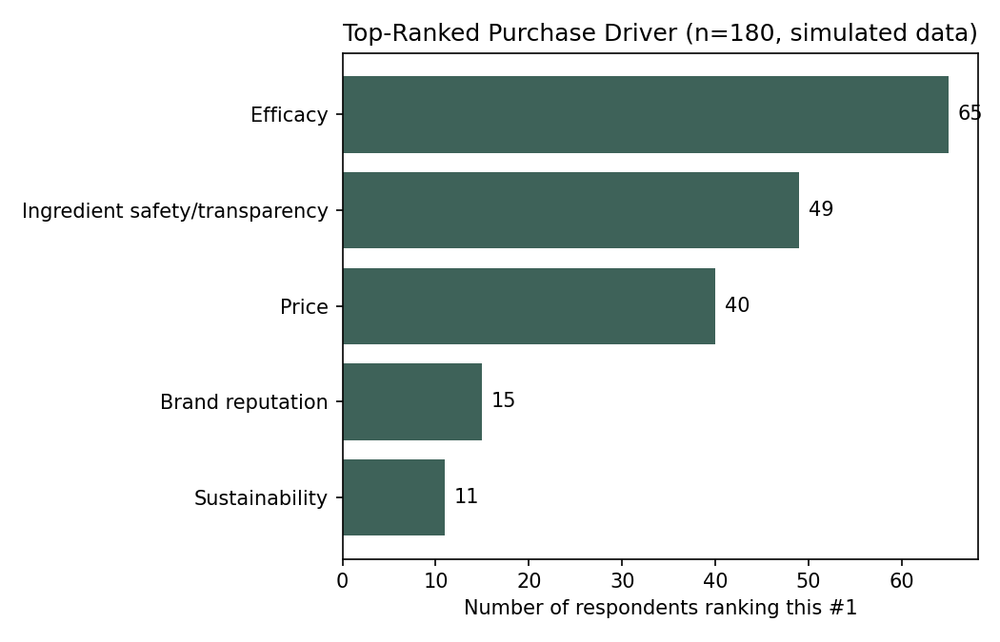
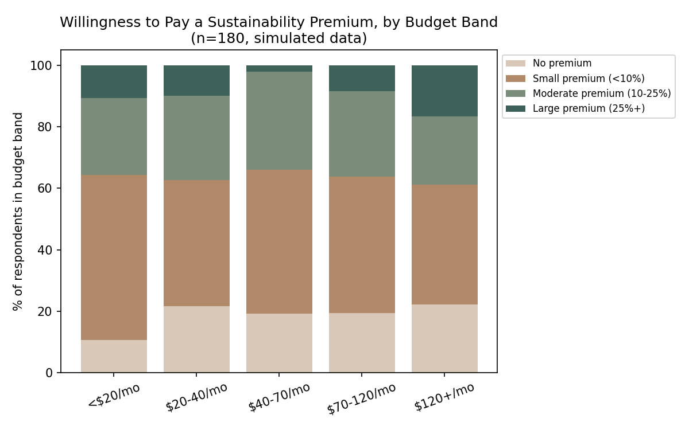

# Consumer Analysis

> Based on `data/simulated_consumer_survey.csv` — **SIMULATED DATA, n=180.** Figures below are illustrative of analytical method, not real business findings.

## 1. Purchase Drivers

| Driver | # ranked #1 | % of respondents |
|---|---|---|
| Efficacy | 65 | 36.1% |
| Ingredient safety/transparency | 49 | 27.2% |
| Price | 40 | 22.2% |
| Brand reputation | 15 | 8.3% |
| Sustainability | 11 | 6.1% |

**Reading:** When forced to rank rather than rate, efficacy dominates as the single most common top purchase driver, followed by ingredient safety/transparency. Sustainability is the *least* commonly top-ranked driver.

**This does not mean sustainability doesn't matter** — it means it is rarely the *primary* reason someone buys. Combined with the willingness-to-pay data below (Section 3), sustainability behaves more like a qualifying differentiator than a headline value proposition.

## 2. Sustainability Perceptions

| Trust level (1=very low, 5=very high) | Respondents | % |
|---|---|---|
| 1 | 31 | 17.2% |
| 2 | 60 | 33.3% |
| 3 | 46 | 25.6% |
| 4 | 31 | 17.2% |
| 5 | 12 | 6.7% |

**Reading:** Over half of respondents (50.5%) sit at trust levels 1–2 — meaningful skepticism toward sustainability claims in the category generally. Only 6.7% report high trust (level 5). This is consistent with widely reported "greenwashing fatigue" in the sustainable consumer goods category.

**Business implication:** A new entrant cannot expect sustainability claims to be taken at face value. Credibility mechanisms (third-party certification, specific/verifiable claims rather than vague ones, transparent sourcing information) matter more than the claim itself.

## 3. Price Sensitivity for Sustainability

**Reading:** Willingness to pay a *large* premium (25%+) for credible sustainability credentials is a minority position across every budget band, generally in the high single digits to mid-teens percentage-wise. Willingness to pay a *small* premium (<10%) is much more common across all bands.

**Business implication:** Sustainability should be positioned as included in a well-justified price point, not sold as a large stand-alone price premium. Consumers appear willing to reward sustainability modestly, not pay significantly more for it alone.

## 4. Product Preference Attributes

From the full dataset (see `data_dictionary.md` for all fields):

- **Preferred texture:** Gel and Lotion together account for the majority of stated preferences — consistent with demand for lightweight, fast-absorbing formats over heavier creams/balms.
- **Preferred packaging:** Tube and Pump formats are preferred over Jar by a wide margin, most commonly attributed (in the underlying question design) to hygiene/contamination concerns — a well-documented consumer concern with jar packaging in the category generally.

## 5. Demographic Segmentation

See [`segmentation.md`](segmentation.md) for a full breakdown of how purchase drivers and sustainability attitudes vary by age band and skin concern, and the resulting customer segments.

## 6. Key Insights (Research → Data → Insight → Business Decision)

**Insight 1**
- *Research question:* What do consumers value most when purchasing sustainable skincare?
- *Data:* Efficacy ranks #1 for 36% of respondents vs. 6% for sustainability (Section 1).
- *Insight:* Sustainability functions as a differentiator layered on efficacy, not a standalone driver.
- *Business decision:* Lead brand messaging with a specific, credible efficacy claim; position sustainability as a secondary, supporting pillar rather than the headline.

**Insight 2**
- *Research question:* How credible are sustainability claims perceived to be?
- *Data:* 50.5% of respondents report low trust (levels 1–2) in category sustainability claims (Section 2).
- *Insight:* Generic or unverifiable sustainability claims are likely to be discounted by a meaningful share of the target market.
- *Business decision:* Prioritize specific, verifiable claims (named certifications, disclosed sourcing, quantified packaging content) over broad sustainability language in marketing copy.

**Insight 3**
- *Research question:* How should sustainability be reflected in pricing?
- *Data:* Willingness to pay a large premium for sustainability is a minority position at every budget level (Section 3).
- *Insight:* Sustainability should be priced in, not priced as a large add-on.
- *Business decision:* Set pricing based primarily on perceived efficacy/quality positioning; avoid a pricing narrative that frames sustainability as the reason for a significant price gap versus conventional competitors.
